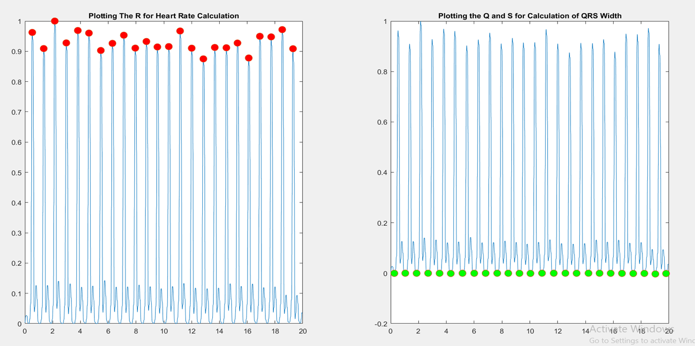

# Pan-Tomkins-Method-for-QRS-Detection :white_check_mark:
# What is QRS:
The QRS complex is the combination of three of the graphical deflections seen on a typical electrocardiogram (ECG). It is usually the central and most visually obvious part of the tracing; in other words, it's the main spike seen on an ECG line. It corresponds to the depolarization of the right and left ventricles of the human heart and contraction of the large ventricular muscles  

# How Pan Tomkins Algorithm Works:
The Pan–Tompkins algorithm applies a series of filters to highlight the frequency content of this rapid heart depolarization and removes the background noise. Then, it squares the signal to amplify the QRS contribute. Finally, it applies adaptive thresholds to detect the peaks of the filtered signal. 

# What is Heart Rate:
Heart rate :It is computed as a function of the distance in seconds between two consecutive QRS complexes

# What is QRS Width:
QRS Width :It is computed as a function of the distance in seconds of a QRS complexes

# Plot of First ECG Signal QRS Complex: 	💚 :green_heart:
 

# Results Obtained 🤞
 ## Plot of First ECG 
 QRS Width of 1st Dataset = 0.163seconds   
 QRS Width of 2nd  Dataset = 0.126 seconds  
 QRS Width of 3rd  Dataset = 0.090 seconds  
 QRS Width of 4th  Dataset = 0.119 seconds  
 Result (Avg. QRS Width): 0.124 seconds  
 ----------------------------------------
 Heart Rate of 1st Dataset = 75  
 Heart Rate of 2nd  Dataset = 96  
 Heart Rate of 3rd  Dataset = 78  
 Heart Rate of 4th  Dataset = 99  
 Result (Avg. Heart Rate): 87
---------------------------------------

# Source of Dataset:
http://people.ucalgary.ca/~ranga/enel563/SIGNAL_DATA_FILES/
